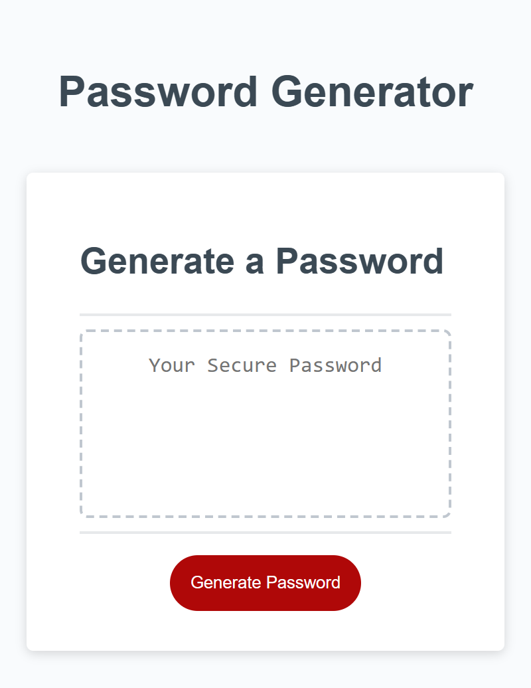

# Secure Password Generator Starter Code

My motivation was to build the Secure password generator application by using my javascript skills which can help me to get a part-time job as a tester while i am still continuing my studies. 

I build this project for an employee to generate a random password based on there selected criteria.

This app will help employee to generate random password with there selected length and tyes of characters. If the user is selecting invalid entry then the window will alert them with notification message and asked them to choose or select valid options. Once user enters all valid answers then the app will generate random password with selected length and character types.

Problems which i solved to make my website look more functional are:
1) Gave user multiple choice for selecting the characters of there choice.
2) Also giving them an option to choose length of there choice to make password more stronger.

By building this project i learned some new skills which contains:
1) How to add event listener function and what it does.
2) How to run function with the help of variables.
3) How to test the application.

## Installation

https://parth0415.github.io/Secure-Password-Generator/

## Usage

## LICENSE
Please refer to the LICENSE in the repository.

